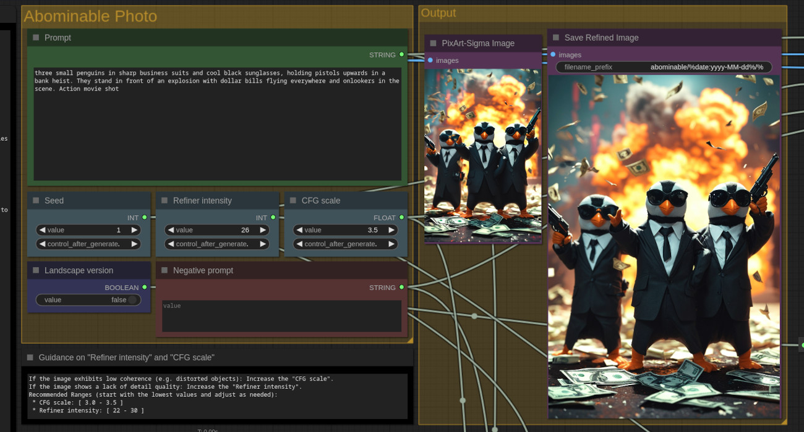

# Abominable Workflow
**A comfyui workflow for PixArt-Sigma employing SD15 to boost its visual impact.**

The **Abominable Workflow** combines the high prompt adherence of PixArt-Sigma
with the impactful visual detail of the SD1.5 models that we've always loved.

 * [Required Files](#required-files)
 * [Required Nodes](#required-nodes)
   * [Automatically Installing Required Nodes](#automatically-installing-required-nodes)
   * [Manually Installing Required Nodes on Linux](#manually-installing-required-nodes-on-linux)
   * [Manually Installing Required Nodes on Windows](#manually-installing-required-nodes-on-windows)

## Required Files

The following models must be installed in ComfyUI:

 * In the folder `<your-comfyui-dir>/models/checkpoints/`:
   * PixArt-Sigma-1024.safetensors
   * Photon-Refiner.safetensors
 * In the folder `<your-comfyui-dir>/models/clip/`:
   * T5-Encoder-Q5_K_M.gguf
 * In the folder `<your-comfyui-dir>/models/vae/`:
   * PixArt-Sigma-VAE.safetensors

## Required Nodes

ComfyUI must also have the following custom nodes installed:
 * **ComfyUI_ExtraModels**: Provides support for PixArt-Sigma.
 * **ComfyUI-GGUF**: Provides support for the GGUF format (quantized T5).
 * **ComfyUI-Crystools**: Used for some simple string operations.

### Automatically Installing Required Nodes

The best way to install the required nodes is to use [ComfyUI-Manager](https://github.com/ltdrdata/ComfyUI-Manager).
This is an extension for ComfyUI that offers management functions to install,
remove, disable, and enable various custom nodes. From there, you can easily
install the required nodes.

### Manually Installing Required Nodes on Linux

*To be completed soon...*

### Manually Installing Required Nodes on Windows

*To be completed soon...*

## Project Checklist

- [x] Editable parameters grouped together.
- [ ] Explanation of how to install required files.
- [ ] Explanation of how to manually install nodes on Linux and Windows.
- [ ] Support for 2K model.
- [ ] Simplify installation process.
- [ ] Automatic detection of model used.
- [ ] Automatic image size selection.

## Lincense

Copyright (c) 2024 Martin Rizzo  
This project is licensed under the MIT license.  
See the ["LICENSE"](LICENSE) file for details.

